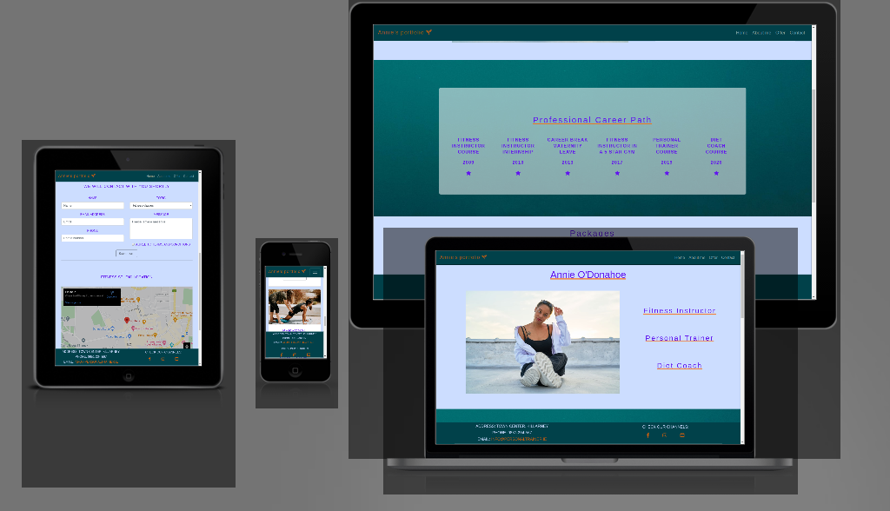
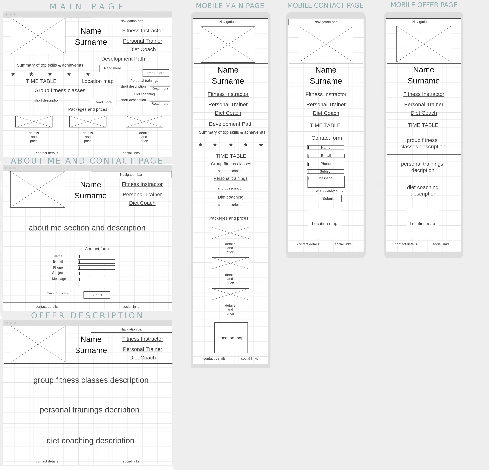
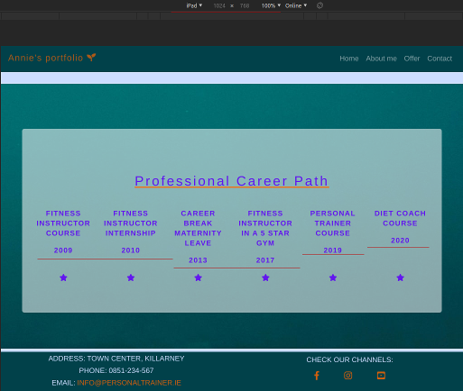
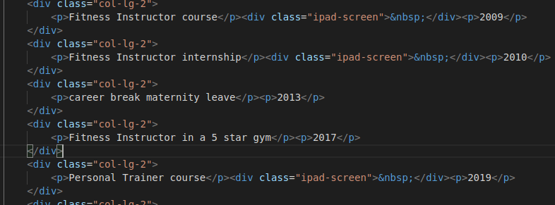
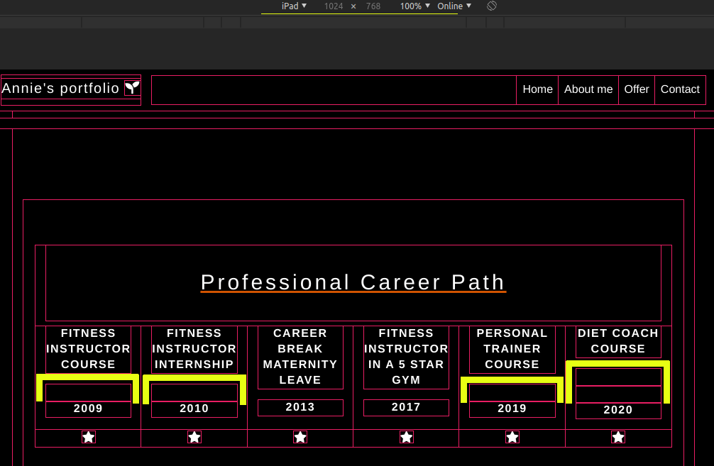
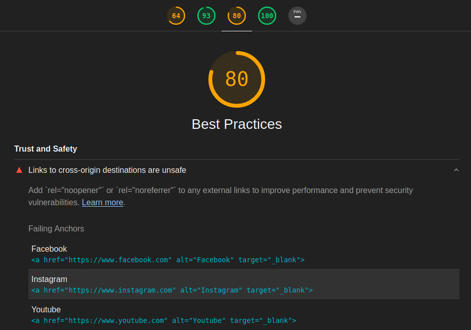
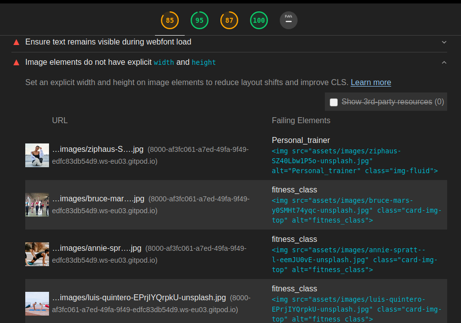
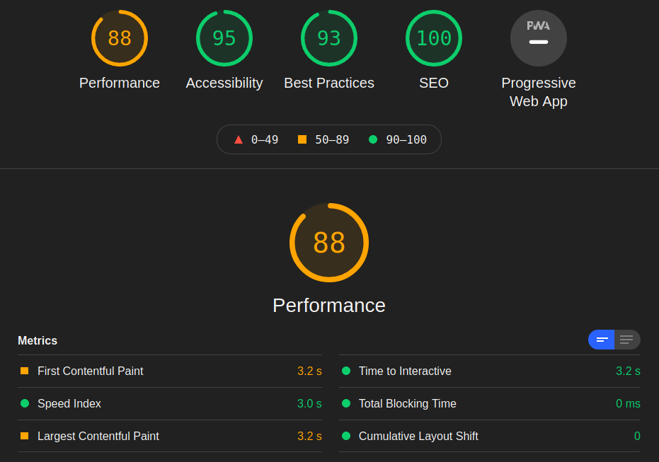

# Annie's Portfolio website

## User-Centric Frontend Development Milestone Project.

Website presents Annie's portfolio as a fitness instructor, personal trainer and diet coach.
Users will be able to find interesting content in easy and simple way.

This project is for educational purposes and can be used as a template for a business use.
Main aim is to build responsive website with HTML and CSS only. I will use Bootstrap framework to keep website consent and clear.

## [View life website in github pages](https://marcin-kli.github.io/MP1/)
---

# Table of contents

- [UX](#ux)
    - [Website owner business goals](#website-owner-business-goals)
    - [User goals](#user-goals)
        - [New user goals](#new-user-goals)
        - [Returning user goals](#returning-user-goals)
        - [Website owner business goals](#website-owner-business-goals)
    - [User stories](#user-stories)
    - [Structure of the website](#structure-of-the-website)
    - [Wireframes](#wireframes)
    - [Surface](#surface)
- [Features](#features)
- [Technology](#technology)
- [Testing](#testing)
    - [Functionality testing](#functionality-testing)
    - [Compatibility testing](#compatibility-testing)
    - [Code Validation](#code-validation)
    - [User stories testing](#user-stories-testing)
    - [Issues found during site development](#issues-found-during-site-development)
    - [Performance testing](#performance-testing)
- [Deployment](#deployment)
- [Credits](#credits)

# UX

## Website owner business goals

The main reason to create this website is to help present a fitness instructor to the public. Page owner can present herself, her professional development path, achievements and top skills. Also this website is the best place to show types of fitness classes, personal training and diet coaching descriptions. And at the end owner will be able to present an offer with available packages and prices.

## User goals

### New user goals:
- user is able to find information about professional fitness trainer,
- user can easily locate class description, personal training sessions description and diet coaching sessions description
- find location of the place and contact information

### Returning user goals:
- user can learn more about instructor
- user is able to find timetable
- user can send a message to the instructor using a contact form

### Website owner business goals

The main reason to create this website is to help present a fitness instructor to the public. Page owner can present herself, her professional development path, achievements and top skills. Also this website is the best place to show types of fitness classes, personal training and diet coaching descriptions. And at the end owner will be able to present an offer with available packages and prices.

## User stories

### As a business owner:
* I would like to present myself and my offer on the website clearly to potential customers.
* I need to make sure that my current and new customers will find a professional help with their diets, personal or group trainings.
* I want my customers to be able to learn how to use my website intuitively and easily.
* I would like to build and maintain relationship with potential and current customers.

### As a new customer:
* wish to find information about personal trainer and check her/his qualifications.
* I would like to contact with a diet coach to change my eating habits and start healthy lifestyle. 
* I want to join in a fitness group with professional trainer, to find motivation and spend time actively.

### As a returning customer:

* I need to contact my diet coach to reschedule my meeting.
* I would like to check timetable for current days and times for a group trainings.
* I want to show my friend a location of the fitness studio where we can join for a semi private personal training.

## Structure of the website

The website is designed to be easy and user-friendy on all type of devices. On desktop, tablet or mobile device there should be no difference for a user to have a fantastic experience. All parts are designed to achieve maximum user satisfaction. User will get some interaction from the interface as links and buttons will have a hover effects.

## Wireframes

## Surface

### Colors
Main colours used in project:
* background color: #ccddff
* font color: #6217ee
* link color: #ff6600
* hoover color: #ff9000

### Fonts 

* As a main font I used Almarai, and as a backup font sans-serif

### Images

* I used images from [Unspalsh.com](www.unsplash.com) and there are credited in [credits](#credits) secion.

[Back to Table of contents](#table-of-contents)
___
# Features

The website consists of 6 pages. Four are accessible from a navigation menu.
One is a 404 error page and one is a submission confirmation page for a form.

The website has below features:

## Navigation bar

* #### Navigation bar is visible on the top of each website. It is responsive and will adapt to mobile devices by change into a burger menu.
* Navigation scheme:

    * On left side there is a logo. It can be used as navigation link to the main page.
    * On right side there are four links or burger menu. It contains:
        * Home
        * About me
        * Offer
        * Contact

## Timetable

* Each site has a timetable on the bottom. Customers can find classes times here.

## Footer

* Footer is consistent on all pages. It has contact details on left side and social links on right side.
Each link will open in a separate tab in a browser.

## Home

* ### Portfolio section

    * Portfolio includes an image in left side and profession information or right side.
This section is consistent on all pages.

* ### Career path section

    * Career path section contains top achievements and career  points. It is presented as a timeline.

* ### Packages section

    * This part has three packages to choose for a customers. All buttons are linked to offer site.

## About me

* About me gives information about Annie's life and her professional background.

## Offer

* This site provide packages description to customers.
Here they can find more information and choose interesting offer.

## Contact

* Contact form is a main part on this site. User can contact by filling a form with interesting topic.
Below a form there is a map with location of a fitness studio.

##  Future implementations

* Create diet coach offer.
* Add new site with class descriptions.
* A blog site with fitness advises.
* Login site for paid content including videos, meals ideas and recipes.

[Back to Table of contents](#table-of-contents)
___
# Technologies used

### HTML5
* As a structure language.

### CSS
* As a style language.

### Bootstrap 
* Bootstrap@4.5.3 as a CSS framework to keep responsive, mobile first aproach.

### Font Awesome
* As an icon library for a social links.

### Google fonts
* As a font resource.

### GitHub
* As a software hosting platform to keep project in a remote location.

### Git
* As a version-control system tracking.

### Gitpod
* As a development hosting platform.

### Wireframe.cc
* As a wireframing tool.

### GNU Image Manipulation Program [GIMP]
* As an image editor.

[Back to Table of contents](#table-of-contents)

___
# Testing

## Functionality testing 

 I used Mozilla web developer tools and Chrome developer tools throughout the project for testing and solving problems with responsiveness and style issues.
 
 [Unicorn Revealer](https://chrome.google.com/webstore/detail/unicorn-revealer/lmlkphhdlngaicolpmaakfmhplagoaln?hl=en-GB) extension to chrome browser was very helpful.

## Compatibility testing
 Site was tested across multiple virtual mobile devices and browsers. I checked all supported devices in both Mozilla web developer tolls and Chrome developer tools. 
 
 I tested on hardware devices such as: Lenovo ideapad with Ubuntu and Windows OS's, Lenovo smartphone with Android 7, Google pixel 3 with Android 11.

## User stories testing

### As a business owner:

- I would like to present myself and my offer on the website clearly to potential customers.
    > Name, photo of the instructor and top skills are on each page in portfolio section. Career path section at home page provides more details.

- I need to make sure that my current and new customers will find a professional help with their diets, personal or group trainings.
    > Customers can achieve this by contacting through contact form. They can choose interesting topic and describe their needs in a message box.

- I want my customers to be able to learn how to use my website intuitively and easily.
    > Each site has a fixed navigation menu and is accessible at all times. All content is presented with minimalistic approach.

- I would like to build and maintain relationship with potential and current customers.
    > Customers are able to find a links to social channels at the bottom of each page. Alternatively they can contact by email or contact form.

### As a new customer:
- wish to find information about personal trainer and check her/his qualifications.
    > User can see essential description on the home page. More information can be find in about page.

- I would like to contact with a diet coach to change my eating habits and start healthy lifestyle.
    > User can find a contact form in contact page. Alternatively can use an email. Email address if located in a footer the bottom of each page.

- I want to join in a fitness group with professional trainer, to find motivation and spend time actively.
    > Brief class description of fitness group classes can be find on the home page below career path section. Offer site provides more detailed description. Frome there user can click contact us button and send a message to the traier.

### As a returning customer:
- I need to contact my diet coach to reschedule my meeting.
    > User can find a contact form in contact page. Alternatively can use social channels or email.

- I would like to check timetable for current days and times for a group trainings.
    > Each site has time table at the bottom of the page.

- I want to show my friend a location of the fitness studio where we can join for a semi private personal training.
    > Each page contains location information in a footer. Users are able to find a location map in contact page.

---
## Issues found during site development

* #### Horizontal scrolling bar on the bottom of the screen.

I used [grid markup](https://getbootstrap.com/docs/4.5/components/card/#header-and-footer)
to create two sepereate collumns. To achieve this I had to use *.row* in first *div* element and *.col-sm-6* in the second *div* element.
After that I found that horizontal scrolling bar appear on the bottom of the screen.
Using mozilla developer tools I noticed that by default class *.row* has *margin-right: -15px;* and *margin-left: -15px;*

To fix this I created new class and *.no-row-margin* and set both margins to 0px.

> After I gain more experience with bootstrap I found that I could achive this by [no-gutters](https://getbootstrap.com/docs/4.0/layout/grid/#no-gutters) class.

> I read bootstrap documentation about [Spacing](https://getbootstrap.com/docs/4.0/utilities/spacing/) and I decided to use predefined classes for paddings and margins. By doing this I think my code looks cleaner and will be easier to understand by other developers.

* #### Ipad screen compatibility

I found a bugs on Ipad screens. I would like to keep years date just above the stars, but they were shifted.

I had to create a block element with a class "ipad-screen" and non-breaking space element inside a block element.
In CSS file I had to create @media rule that will show this block element on Ipad displays only.

>}
@media screen and (max-width: 991px) and (min-width: 0px),(min-width:1200px){
    .ipad-screen {
    display: none;
}
}

## Performance testing

I run [Lighthouse](https://developers.google.com/web/tools/lighthouse/) tool to check performance of the website.
I had to do couple of changes to improve performance. Screenshots are presented below:

Final results:

I noticed that this tests scores vary from time to time and they depend on external libraries as well. 

## Code Validation
 At the and of the project I used two websites to validate a code
 
 * [W3C CSS Validator](https://jigsaw.w3.org/css-validator/) to validate CSS
 * [Nu Html Checker](https://validator.w3.org/) to test HTML

[Back to Table of contents](#table-of-contents)

___
# Deployment

[Back to Table of contents](#table-of-contents)
___
# Credits

* To complete this project I used Code Institute student template [gitpod full template](https://github.com/Code-Institute-Org/gitpod-full-template)

* Ideas and knowledge library:

    * [w3schools.com](https://www.w3schools.com)

    * [css-tricks.com](https://css-tricks.com/)

    * [getbootstrap.com/docs](https://getbootstrap.com/docs/4.5/getting-started/introduction/)
        I used code for navbar, jumbotron and card from Bootstrap.

### Content:
*  General content:  [fitlife.ie](http://fitlife.ie/lessons-its-your-life-your-fit-life/)

### Map location:
* [fitlife.ie](http://fitlife.ie/)

### Map:
* [Google maps](https://www.google.com/maps?ll=52.059441,-9.511501&z=16&t=m&hl=en-US&gl=US&mapclient=embed&cid=7306226195280410511)

### Images:

#### Unsplash.com:
* [annie-spratt--l-eemJU0vE-unsplash.jpg](https://unsplash.com/photos/-l-eemJU0vE)

* [ziphaus-SZ40Lbw1P5o-unsplash.jpg](https://unsplash.com/photos/SZ40Lbw1P5o)

* [bruce-mars-y0SMHt74yqc-unsplash.jpg](https://unsplash.com/photos/y0SMHt74yqc)

* [luis-quintero-EPrjIYQrpkU-unsplash.jpg](https://unsplash.com/photos/EPrjIYQrpkU)

* [sven-scheuermeier-saGbrA6s8g0-unsplash.jpg](https://unsplash.com/photos/saGbrA6s8g0)

[Back to Table of contents](#table-of-contents)
___