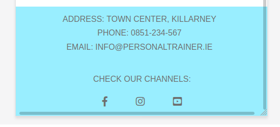

# User-Centric Frontend Development Milestone Project

This project is for educational purposes and can be used as a template for a business use.
Main aim is to build responsive website with HTML and CSS only.

---

# Table of contents

- [UX](#ux)
    - [Website owner business goals](#website-owner-business-goals)
    - [User goals](#user-goals)
        - [New user goals](#new-user-goals)
        - [Returning user goals](#returning-user-goals)
        - [Website owner business goals](#website-owner-business-goals)
    - [User stories](#user-stories)
    - [Structure of the website](#structure-of-the-website)
    - [Wireframes](#wireframes)
- [Features](#features)
- [Technology](#technology)
- [Testing](#testing)
- [Deployment](#deployment)
- [Credits](#credits)
# UX

## Website owner business goals

The main reason to create this website is to help present a fitness instructor to the public. Page owner can present herself, her professional development path, achievements and top skills. Also this website is the best place to show types of fitness classes, personal training and diet coaching descriptions. And at the end owner will be able to present an offer with available packages and prices.

## User goals

### New user goals:
- user is able to find information about professional fitness trainer,
- user can easily locate class description, personal training sessions description and diet coaching sessions description
- find location of the place and contact information

### Returning user goals:
- user can learn more about instractor
- user is able to find timetable
- user can send a message to the instractor using a contact form

### Website owner business goals

The main reason to create this website is to help present a fitness instructor to the public. Page owner can present herself, her professional development path, achievements and top skills. Also this website is the best place to show types of fitness classes, personal training and diet coaching descriptions. And at the end owner will be able to present an offer with available packages and prices.

## User stories

### As a business owner:
* I would like to present myself and my offer on the website clearly to potential customers.
* I need to make sure that my current and new customers will find a professional help with their diets, personal or group trainings.
* I want my customers to be able to learn how to use my website intuitively and easily.
* I would like to build and maintain relationship with potential and current customers.

### As a new customer:
* wish to find information about personal trainer and check her/his qualifications.
* I would like to contact with a diet coach to change my eating habits and start healthy lifestyle. 
* I want to join in a fitness group with professional trainer, to find motivation and spend time actively.

### As a returning customer:

* I need to contact my diet coach to reschedule my meeting.
* I would like to check timetable for current days and times for a group trainings.
* I want to show my friend a location of the fitness studio where we can join for a semi private personal training.

## Structure of the website

The website is designed to be easy and user-friendy on all type of devices. On desktop, tablet or mobile device there should be no difference for a user to have a fantastic experience. All parts are designed to achieve maximum user satisfaction. User will get some interaction from the interface as links and buttons will have a hover effects.

## Wireframes

---

# Features

# Technology

### HTML5
* As a structure language.

### CSS
* As a style language.

### Bootstrap bootstrap@4.5.3
* As a CSS framework to keep responsive, mobile first aproach.

### Font Awesome
* As an icon library to keep user-friendly design.

### Google fonts
* As font resource.

### GitHub
* As a software hosting platform to keep project in a remote location.

### Git
* As a version-control system tracking.

### Gitpod
* As a development hosting platform.

### Wireframe.cc
* As a wireframing tool.

### GNU Image Manipulation Program [GIMP]
* As a image editor.

# Testing

### Issues found during site development.

* #### Horizontal scrolling bar on the bottom of the screen.

I used [grid markup](https://getbootstrap.com/docs/4.5/components/card/#header-and-footer)
to create two sepereate collumns. To achieve this I had to use *.row* in first *div* element and *.col-sm-6* in the second *div* element.
After that I found that horizontal scrolling bar appear on the bottom of the screen.
Using mozilla developer tools I noticed that by default class *.row* has *margin-right: -15px;* and *margin-left: -15px;*

To fix this I created new class and *.no-row-margin* and set both margins to 0px.

# Deployment

# Credits

To complete this project I used Code Institute student template [gitpod full template](https://github.com/Code-Institute-Org/gitpod-full-template)

Ideas and knowledge library:
[w3schools.com](https://www.w3schools.com)
[css-tricks.com/](https://css-tricks.com/)
[getbootstrap.com/docs]{https://getbootstrap.com/docs/4.5/getting-started/introduction/}

### Images:
#### Unsplash.com:
[annie-spratt--l-eemJU0vE-unsplash.jpg](https://unsplash.com/photos/-l-eemJU0vE)
[ziphaus-SZ40Lbw1P5o-unsplash.jpg](https://unsplash.com/photos/SZ40Lbw1P5o)
[bruce-mars-y0SMHt74yqc-unsplash.jpg](https://unsplash.com/photos/y0SMHt74yqc)
[luis-quintero-EPrjIYQrpkU-unsplash.jpg](https://unsplash.com/photos/EPrjIYQrpkU)
[sven-scheuermeier-saGbrA6s8g0-unsplash.jpg](https://unsplash.com/photos/saGbrA6s8g0)
